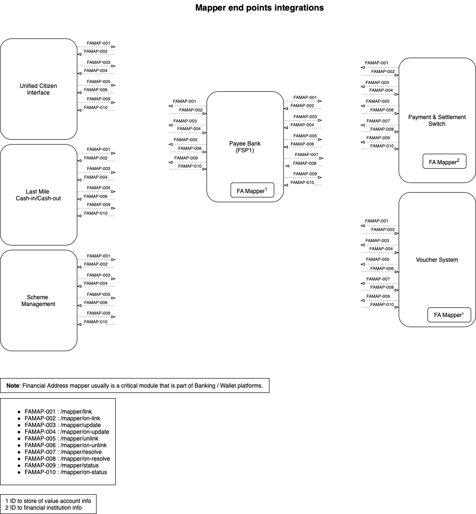

## Overview
1. Standardising linking, unlinking, update, resolve and status check capabilities between G2P enabling DPGS/Products/Systems.
2. Beneficiary identifier can be of national id, id tokens, mobile number, email id, virtual payment ids, user id's, etc that are supported by underlying payment processing/rails platforms.
3. Country operational model shall decide the entity that manages one or more ID to Financial address map registries.

## Interface List

| Interface ID | End Point | Description | 
| ------------ | --------- | ----------- |
| FAMAP-001 | POST [/mapper/link](https://g2p-connect.github.io/specs/dist/g2p-mapper.html#operation/post_g2p_mapper_link) | Linking id / fa to mapper registry | 
| FAMAP-002 | POST [/mapper/on-link](https://g2p-connect.github.io/specs/dist/g2p-mapper.html#operation/post_g2p_mapper_on-link) | Linking status info through callback end point | 
| FAMAP-003 | POST [/mapper/update](https://g2p-connect.github.io/specs/dist/g2p-mapper.html#operation/put_g2p_mapper_update) | Updating fa details to mapper registry|
| FAMAP-004 | POST [/mapper/on-update](https://g2p-connect.github.io/specs/dist/g2p-mapper.html#operation/put_g2p_mapper_on-update) | Update response through callback end point |
| FAMAP-005 | POST [/mapper/unlink](https://g2p-connect.github.io/specs/dist/g2p-mapper.html#operation/post_g2p_mapper_unlink) | remove id/fa link from mapper registry | 
| FAMAP-006 | POST [/mapper/on-unlink](https://g2p-connect.github.io/specs/dist/g2p-mapper.html#operation/post_g2p_mapper_on-unlink) | Unlinking response through callback end point | 
| FAMAP-007 | POST [/mapper/resolve](https://g2p-connect.github.io/specs/dist/g2p-mapper.html#operation/post_g2p_mapper_resolve) | Resolve fa / beneficiary id to a store of value | 
| FAMAP-008 | POST [/mapper/on-resolve](https://g2p-connect.github.io/specs/dist/g2p-mapper.html#operation/post_g2p_mapper_on-resolve) | Resolve response through callback end point | 
| FAMAP-009 | POST [/mapper/status](https://g2p-connect.github.io/specs/dist/g2p-mapper.html#operation/post_g2p_mapper_status) | Status check on any of the mapper actions using transaction_id or reference_id(s) | 
| FAMAP-010 | POST [/mapper/on-status](https://g2p-connect.github.io/specs/dist/g2p-mapper.html#operation/post_g2p_mapper_on-status) | Status check response through callback end point | 

## Request For Comments
1. FA mapper linking status, reason code/message- [FAMAP-002-Status-Codes-Draft-01](https://github.com/G2P-Connect/specs/blob/draft/docs/rfc/specs-draft/FAMAP-002-Status-Codes-Draft-01.md)
2. FA mapper update status, reason code/message- [FAMAP-004-Status-Codes-Draft-01](https://github.com/G2P-Connect/specs/blob/draft/docs/rfc/specs-draft/FAMAP-004-Status-Codes-Draft-01.md)
3. FA mapper unlink status, reason code/message- [FAMAP-006-Status-Codes-Draft-01](https://github.com/G2P-Connect/specs/blob/draft/docs/rfc/specs-draft/FAMAP-006-Status-Codes-Draft-01.md)
4. FA mapper resolve status, reason code/message- [FAMAP-008-Status-Codes-Draft-01](https://github.com/G2P-Connect/specs/blob/draft/docs/rfc/specs-draft/FAMAP-008-Status-Codes-Draft-01.md)

## Integration Schematics

## References
1. API specification [link](https://g2p-connect.github.io/specs/dist/g2p-mapper.html)
2. Discussion [thread](https://github.com/G2P-Connect/.github/discussions/16)