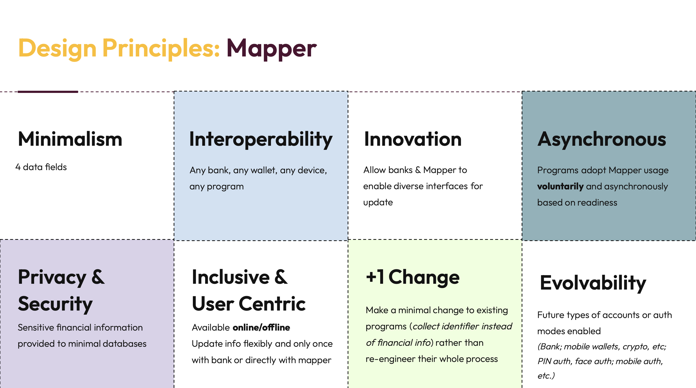
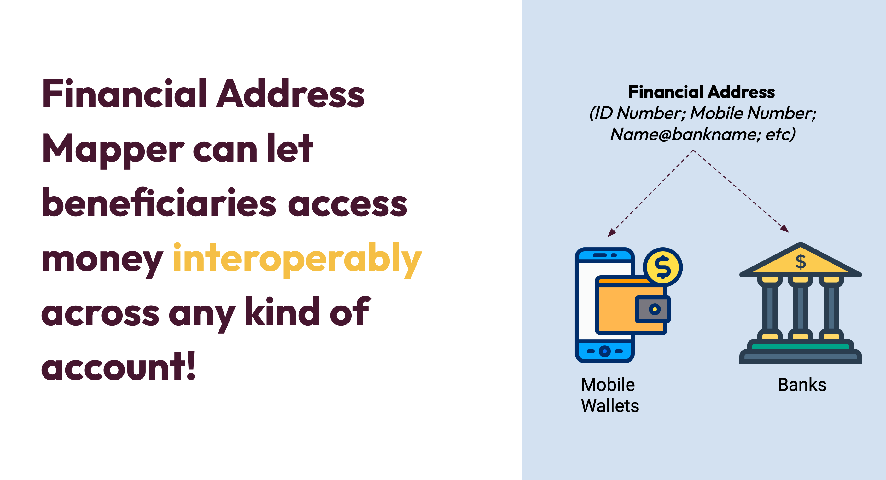
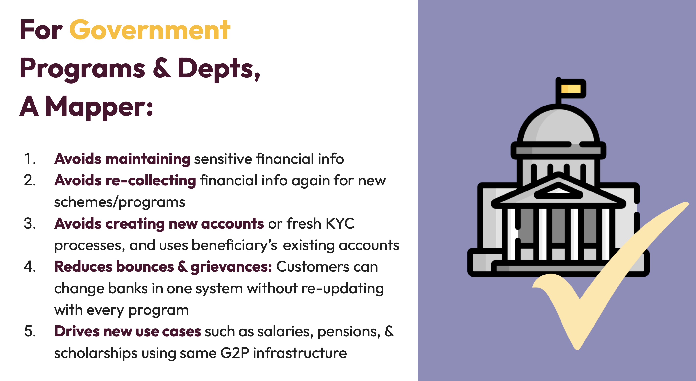
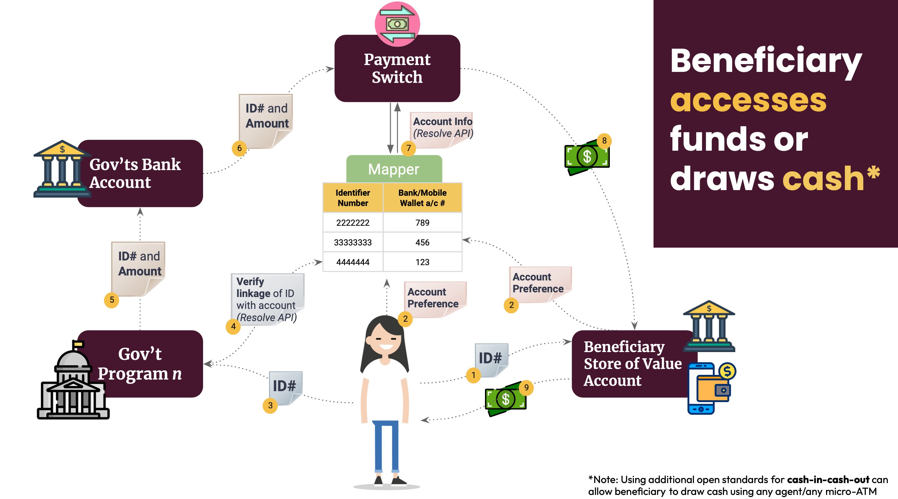
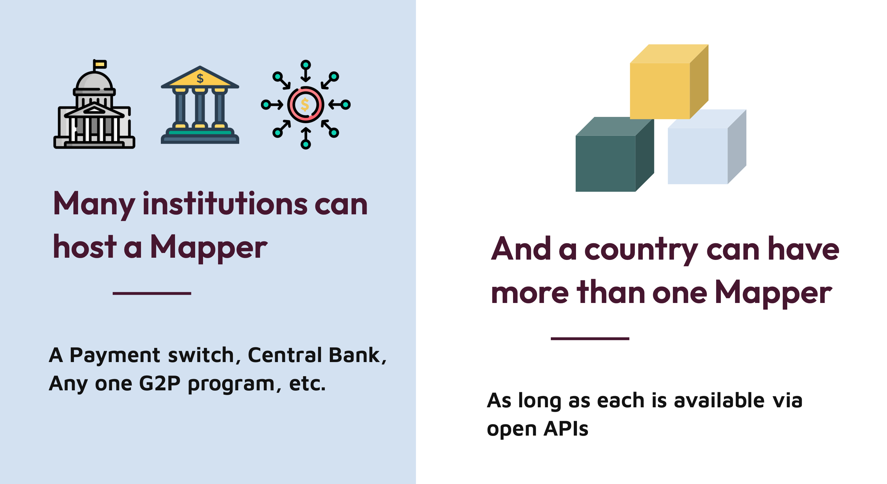

# Financial Address Mapper
## Technology Architecture
### Version 1.0 (Draft)

## 1. Introduction
Governments around the world transfer funds to individuals for a variety of purposes - cash benefits programs, subsidies, salaries, scholarships, etc - which are often programs managed by various departments at federal/national, state/province-level, or district levels. However, a nation can craft a reusable and minimalist digital public infrastructure component that can power multiple departments to run various G2P programs in an efficient and high agency manner. This DPI building block can allow any government department to direct a payment to a financial account using just an identity number from an existing ID system, without recollecting financial information or re-engineering its own payments infrastructure. This architecture document highlights a recommended technology architecture design to enable any government to build its own financial address mapper.

Any Government 2 Person (G2P) Payments program requires two key identifiers to complete the last leg of any benefit disbursement process - 

1. Beneficiary Identifier
2. Target account information. 

The G2P Connect Blueprint, among other functions, enables abstraction of the target account where the beneficiary receives digital payments as a store of value. The store of value can be a Bank Account, Mobile Wallet, Voucher, PrePaid Card, Digital Currency, etc. A Financial Address Mapper is a simple key / value look up registry to manage Beneficiary ID to Store of Value account information as a Digital Public Infrastructure.  Such a mapper is one building block of the G2P Connect Blueprint. 

## 2. Design Principles
Designing a Financial Address Mapper (FAM) should meet below core design principles. It is highly recommended that policy & technical architects take below principles into consideration when conceptualising and designing Financial Address Mapper as a Digital Public Infrastructure.

### 2.1 Minimalism
Financial Address Mapper shall require minimal information about beneficiaries. In an ideal scenario, Only four fields - Beneficiary ID, Name, Store of Value Address, Linking Status - are required to manage this registry. Where possible, the store of value address need not be full bank account/mobile money account details; it can simply direct to the financial institution holding the store of value account.

FAM should avoid having information about benefit schemes, scheme/beneficiary eligibility info, store of value account status, etc., Having minimal data in mapper shall keep external platform/system dependencies to a minimum. 

### 2.2 Interoperability
Building a Financial Address Mapper that is compliant with G2P Connect mapper open specifications allows authorised systems/services to access the mapper. Architecture enables interoperability with any bank, any wallet, any device, and any social protection program. It is up to the policy makers to control which ecosystem participants are allowed to support / implement Mapper features. For e.g., Linking API can be implemented by Social Protection System or Store of Value Account Provider or directly by the Mapper Hosting Entity.

### 2.3 Innovation
Financial Address Mapper specifications use normalised addresses to represent ID and Financial Address. Normalised addressing enables innovation to easily accommodate new forms of  foundational / functional IDs, Store of Value account types. Additionally, allows ecosystem participants innovate capabilities for easy access and updates to mapper.

### 2.4 Asynchornous 
Financial Address Mapper architecture & design unbundle the capabilities to encourage multiple players in the ecosystem to participate in. Financial account information resides in Banking Platforms while other ecosystem participants interact with aliases. This enables interaction between ecosystem participants loosely coupled to encourage market driven play. 

Programs adopt mapper usage voulantarily bases on readiness. This allows adoption to evolve ansynchronusly i.e incrementally rather big bang approach.

### 2.5 Privacy & Security by Design
Financial Address Mapper specifications recommends managing minimal information with optimal ignorance to protect security & privacy of the beneficiary. The design ensures only the required participants will have access to account details for final debit/credit actions on store of value accounts.

### 2.6 Inclusivity & User Centric
The Mapper should be designed to cover multiple types of store of value accounts that are inclusive across the population - for instance bank accounts, wallets, mobile money accounts, etc., Market innovation like purpose limited vouchers, digital currencies etc., can easily be implemented using the G2P Connect proposed normative addressing.

Normative addressing is representing store of value account information using aliases like:

    a. token:12345@mosip
    b. vid:12345@PhilID
    c. account:12345@gtbank
    d. account:12345@HDFC0000001.ifsc.npci
    e. joeuser@gtbank
    f. token:123456@sbi
    g. 12345@DCash

Beneficiaries are central to any Financial Address Mapper design / roll out. Beneficiaries should have easy access to one or more entities to link, manage life cycle events of mapper. Ecosystem players shall innovate to allow self service/assisted use and online/offline access capabilities to reach diverse category of users.

### 2.7 +1 Change
Financial Address Mapper is one such component that can be easily unbundled from the existing platforms/systems/processes to build a new DPI component that opens up non-linear adoption with ease by embracing all aspects of DPI design principles. 

### 2.8 Evolvability
The Financial Address Mapper is not restricted to one instance in a country. G2P Connect Mapper specifications enable multiple mappers to co-exists and easily interoperate with each other through interoperable open specifications. Registries can evolve independently across account types, authentication modes, sectors, regulatory or governance aspects of a country.

## 3. Mapper Ecosystem
A typical Financial Address Mapper ecosystem players are:

### 3.1 Mapper Hosting Entity
Entity managing mapper registry and ecosystem partners. It is recommended a neutral agency to host the mapper. 

Mapper Hosting Entity is responsible for:
1. Onboarding ecosystem partners and enabling access to mapper services through Open APIs, batch file interfaces, etc.,
2. Design, Build, Operate Mapper registry.
3. Regulate and support other ecosystem partners through operational policies based on country specific context.

### 3.2 Store of Value Provider
Store of value providers that have direct relationships with beneficiaries to provide banking / financial services. 

Store of value provider performs below activities:
1. Help interface Beneficiary to manage ID to Store of value address with entity hosting the mapper registry.
2. Authorise mapper linking requests by authenticating the right beneficiary.
3. Provide Resolution of financial address to store of value account info for final leg of digital payment credit using the underlying payment rails.
4. Transfer digital payments to store value accounts.

### 3.3 Beneficiary
A person approved by the social protection system to receive benefits from one or more social protection schemes.

Beneficiaries get following benefits:
1. Manage store of value account info to receive all social benefits with one single entity and manage any life cycle changes only once.
2. Don’t have to share sensitive financial account information with multiple entities.

### 3.4 Social Protection System
System delivering social protection to beneficiaries. 

Social protection systems enable with following capabilities:
Help interface Beneficiary to manage ID to Store of value address with entity hosting the mapper registry.
Create disbursement instructions to payment processing systems/rails to initiate benefit transfer using beneficiary id. 

## 4. Mapper Features
G2P Connect specifications recommends below features to be available to enable seamless integration between G2P payments processing ecosystem participants:

1. Link - Link Store of Value address with a beneficiary ID. Entity enabling beneficiaries to link shall ensure authentication and obtaining required consents. 
2. UnLink - Performs a soft or hard delete of the mapper registry entry.
3. Resolve - Given a foundational or functional ID help find Store of Value normative address. Country specific implementation may allow resolution to financial entity codes or end store of value account identifiers.
4. Status Check - Systems integration service endpoint for applications to communicate and reconcile in an automated manner. Enables reliability and user experience capabilities.
5. Update - Update financial and other linked information. Entity enabling beneficiaries to update shall ensure authentication and obtaining required consents.

Below is an illustration of mapper implemenation to benefit beneficiary to access funds or draw cash:

## 5. Recommended Best Practices

1. G2P Connect specification allows more than one mapper registry within a country. Having a registry within each ministry/agency or sector is perfectly fine as part of initial roll out and if there are enough synergies and trust built up, incremental consolidation will help both implementing agencies, beneficiaries.
2. Entities enabling linking (and life cycle management services) with mapper registry MUST authenticate the Owner of the account holder with the ID of the person being linked is indeed the same person. Specifications allow any existing authentication methods followed by the store of value service provider. 
3. Obtaining consent is decentralised with the entities operating in the mapper registry ecosystem. This enables existing systems and business processes to adopt mapper registry as Digital Public Infrastructure. Migrating to Digital Consents shall help in population scale with trust and enable automation. 

## 6. Next Steps

Countries may use the below checklist to start the DPI journey:

1. The Ministry/Department operating one or more social benefit program(s) may consider a single Mapper Registry as Digital Public Infrastructure building block Department to identify. This agency may own and operate the Mapper registry.
2. Work with ecosystem participants to identify policies and operational guidelines to use the existing services digitally.

## 7. Additional References
1. Financial Address Mapper - [Tech Architecture](../../publications/mapper_v1_0.pdf)
2. Financial Address Mapper - Policy Guidelines 
3. Financial Address Mapper - [Mapper Specification](https://g2p-connect.github.io/specs/dist/g2p-mapper.html)