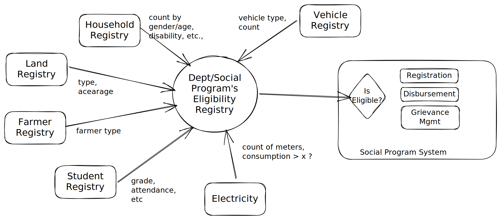

# Eligibility Checks

COVID accelerated the use of the digital payments infrastructure by the various national and sub national governments to enable the Direct Benefit Transfers. While this helped provide support for millions across the world, a new challenge is emerging which requires due attention. In order to make direct transfers governments need to identify the beneficiaries for the various schemes - based on the scheme specific criteria. The data required for determining eligibility may include land holdings, electricity usage, vehicle ownership, financial transactions, age, gender, caste etc. These records currently reside in the respective departments but many ministries/departments are running initiatives to pull data into a centralised database. Over time they have seeded all these databases with Foundational IDs and now are in a position to correlate these data to formulate a comprehensive profile of all the citizens. While the objective of such databases is to identify eligible beneficiaries, there are several challenges in these initiatives that need to be thought through.

1. **Single Source of Truth** - The respective departments are the legal “registrars” of the respective attributes e.g. Vehicle records are owned by the Road Transport Department and so on. If data is being pushed into the central database, the ownership of ensuring the data is up to date should reside with the respective departments. The system must be designed in a manner to ensure that the most recent record is used to determine the eligibility criteria.
2. **Security** - Creating such a centralised database will make it a high risk asset and will require substantial investments in security to ensure adequate protection.
   1. Privacy - Several questions around privacy arise which needs to be addressed e.g. will beneficiaries have visibility in the attributes that are being stored and used for eligibility determination, is there a process for them to raise correction requests, what mechanisms are put in place to ensure limit purpose of use of these databases, can beneficiaries opt out of such a database, etc.
3. **Anomaly Detection** - Since this database will be used for beneficiary eligibility, it will be a target for fraud. Mechanisms need to be put in place to detect anomalies e.g. population stability indexes must be computed and compared to ensure no large scale changes in the database are happening to enable inclusion in a specific scheme.

To address the above concerns, designers of these systems must consider federated services architecture rather than centralised databases. Instead of pulling all the data into a central database, it may be possible to implement a centralised “Beneficiary Eligibility” service which in turn calls respective departments “Beneficiary Eligibility” service that returns a “Yes/No” answer or minimal required information. So a scheme system queries the centralised beneficiary eligibility API by sending one or multiple records to it. The service then calls the respective department systems to check the beneficiary eligibility in their respective databases and revert with a result.

The social program registry may cache minimal information with aggregarted, yes/no information to enable eligibility determination. Additionally, subscribe/notify api's shall help scoial program registry to get notified on any source data changes at an agreed frequency to keep the data current.

A federated architecture as above ensures the legal registrars of the data are enabled to determine the eligibility rather than transferring control of such an activity to a central department. It ensures a single source of truth which is the legal registrars of the respective data. There is no escalation of security and privacy risks beyond what already exists in these existing databases.

Registration into social program scheme is one place where beneficiary may provide/revoke consent to access any of the databases. Social program eligibility rules determine the source data sources to be linked to enable eligibiltiy determination.

<figure><figcaption></figcaption></figure>

Federated registry access is possible using standardised [registry search api](../../registries.md)
