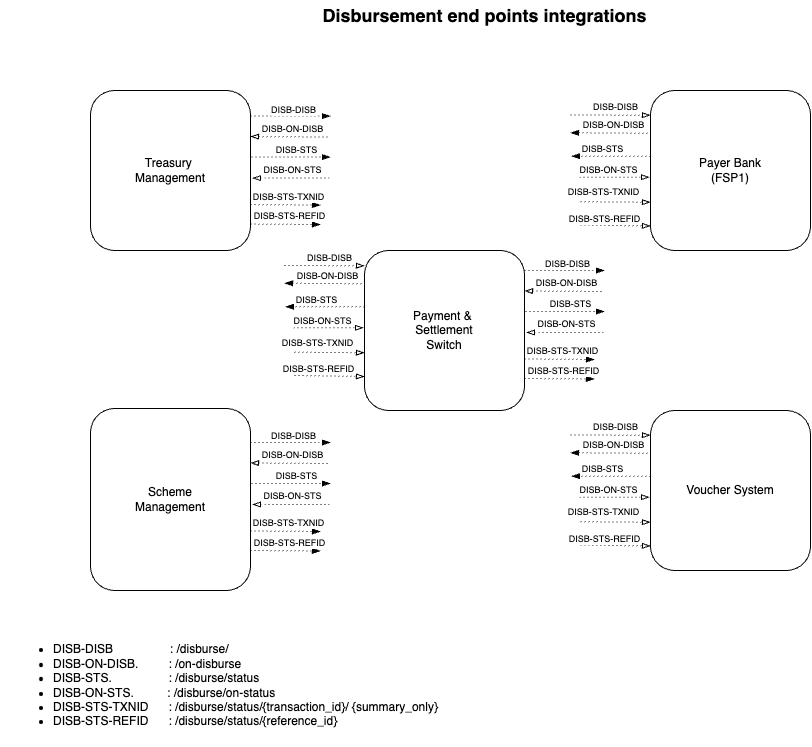

# Dibursement

### Overview

1. G2P Connect payment disbursement APIs intent is to enable standrdisation between social protection and payment processing/rails systems integration.
2. Disburse and DisburseStatue are core entities to enable generation of payment instruction and reconcile processing status.

### References

1. API specification [link](https://g2p-connect.github.io/specs/dist/g2p-disburse.html)
2. Disbursement feature relate [discussion thread](https://github.com/G2P-Connect/.github/discussions/15)

### Interface List

| Interface ID   | End Point                                               | Description                                                                                  |
| -------------- | ------------------------------------------------------- | -------------------------------------------------------------------------------------------- |
| DISB-DISB      | POST /disburse                                          | Social protection platofrom initiating g2p disbursements                                     |
| DISB-ON-DISB   | POST /on-disburse                                       | Disbursement initiating systems receive disbursement status info through callback end points |
| DISB-STS       | POST /disburse/status                                   | Request for disbursement status from (e.g) social protection, Treasury systems               |
| DISB-ON-STS    | POST /disburse/on-status                                | Disbursement status to social protection, Treasury systems.                                  |
| DISB-ON-TXNSTS | POST /disburse/txn/status                               | Disbursement status to social protection, Treasury systems.                                  |
| DISB-ON-TXNSTS | POST /disburse/txn/on-status                            | Disbursement status to social protection, Treasury systems.                                  |
| DISB-STS-TXNID | GET /disburse/status/{transaction\_id} /{summary\_only} | Disbursement status to social protection, Treasury systems                                   |
| DISB-STS-REFID | GET /disburse/status/{reference\_id}]                   | Disbursement status to social protection, Treasury systems                                   |

### Integration Schematics

<figure><figcaption></figcaption></figure>
